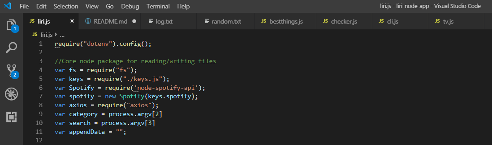
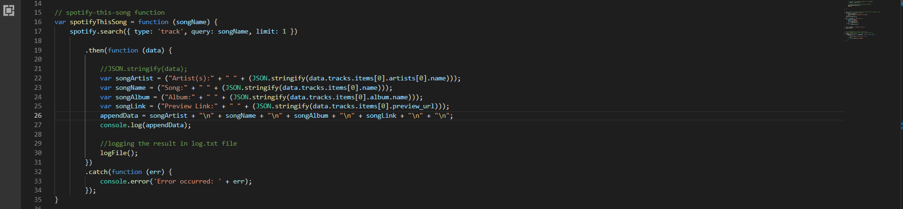
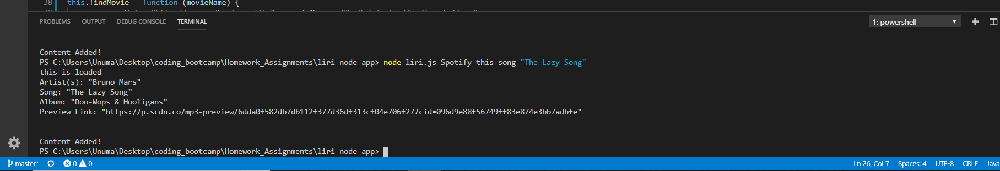
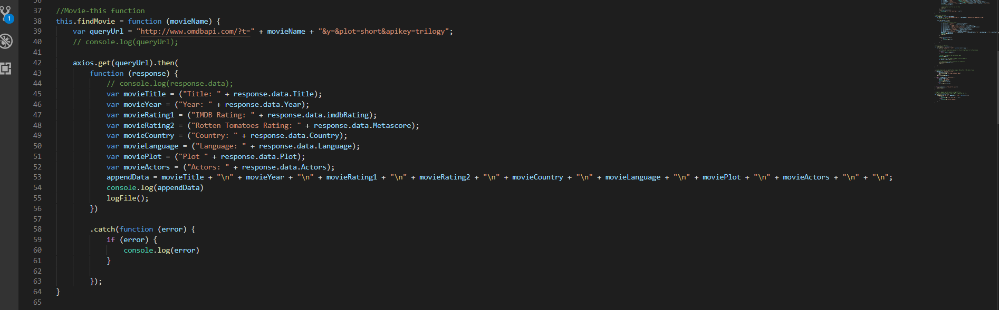
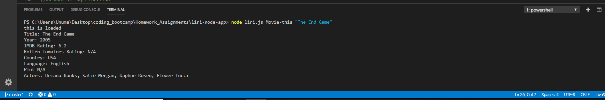

# liri-node-app
LIRI is a Language Interpretation and Recognition Interface. It's command line node app that takes in parameters and gives you back data. 

*It will search **Spotify** for songs and **OMDB** for movies.

**Node Packages used for this program:**
* Node-Spotify-API
* Axios
* Moment
* DotEnv

;

**This App performs following 4 functions:**
1. **Spotify-this-song**

   ; 
   * This function will search Spotify API for the required song. 
   **Command to run in Terminal:** node liri.js spotify-this-song "song name here"

   ; 

   * This command will display following details of the required song:
      * Artist(s)
      * Song Name
      * Album
      * Preview Link

2. **Movie-this**

    ;
    * This function will search OMDB API for the required movie name.

     **Command to run in Terminal:** node liri.js Movie-this "movie name here"
     ; 
     * This command will display following details of the required movie:
        * Title of the movie.
        * Year the movie came out.
        * IMDB Rating of the movie.
        * Rotten Tomatoes Rating of the movie.
        * Country where the movie was produced.
        * Language of the movie.
        * Plot of the movie.
        * Actors in the movie.

3. **Do-what-it-says**

4. Log File
